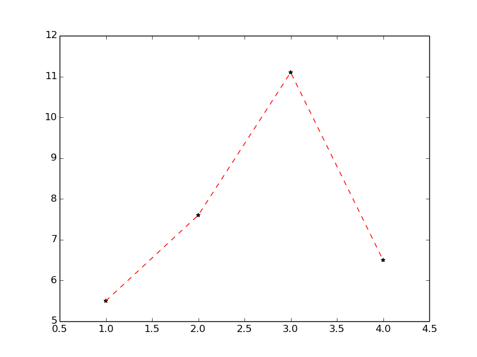

# examples

## plot types

### line, scatter with defaults

```nim
let figure = newFigure()
figure.add newLinePlot[int,float](@[1, 2, 3, 4], @[5.5, 7.6, 11.1, 6.5])
```


### line, scatter with options

```nim
let figure2 = newFigure()
let lp = newLinePlot[int,float](x, y)
lp.linestyle = "--"
lp.colour = "red"
figure2.add lp
let sp = newScatterPlot[int,float](x, y)
sp.colour = "green"
figure2.add sp
```


Custom markers:

```nim
sp.marker = "*"
figure2.save("docs/marker.png")
```



### histograms

With default values:

```nim
let samples = rnorm(1000, 0.0, 2.0)
let figure3 = newFigure()
let hist = newHistogram[float] samples
figure3.add hist
```


With custom number of bins:

```nim
hist.bins = 200
figure3.save "docs/hist_bins.png"
```


### line segments

With default values:

```nim
let figure4 = newFigure()
let x4 = toSeq(0..100)
let y4 = x4.map(proc(k:int):float = float(k).pow(2.0))
figure4.add newLinePlot(x4, y4)
figure4.add newLine((2, 4.0),(70, 70.0.pow(2.0)))
```


Customised:

```nim
lp4.colour = "black"
line.colour = "red"
line.linestyle = "--"
```


### titles and fonts

A plot with a title and custom font ("courier new" in this case):

```nim
let figure5 = newFigure()
let x5 = toSeq(0..1000)
let y5 = x5.map(func(k:int):float = sin(float(k) / 50.0))
figure5.font = ("monospace", "Courier New")
let lp5 = newLinePlot(x5, y5)
lp5.colour = "red"
figure5.add lp5
figure5.add newTitle("A plot with a title (in Courier New).")
```

