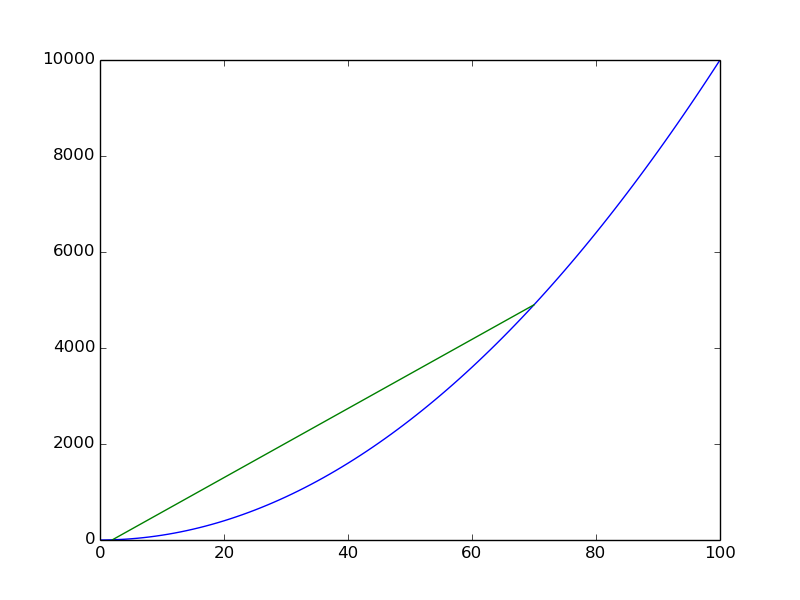

# examples

## plot types

### line, scatter with defaults

```nim
let x = @[1, 2, 3, 4]
let y = @[5.5, 7.6, 11.1, 6.5]

discard plt.figure()
discard plt.plot(x, y)
```


### line, scatter with options

```nim
discard plt.figure()
discard plt.plot(x, y, linestyle="--", c="red")
discard plt.scatter(x, y, c="green")
```


Custom markers:

```nim
discard plt.figure()
discard plt.plot(x, y, linestyle="--", c="red")
discard plt.scatter(x, y, c="green", marker="*")
```


### histograms

With default values:

```nim
let samples = rnorm(1000, 0.0, 2.0)
discard plt.figure()
discard plt.hist(samples)
```


With custom number of bins:

```nim
discard plt.figure()
discard plt.hist(samples, bins=200)
```


### line segments

With default values:

```nim
discard plt.figure()
let x4 = toSeq(0..100)
let y4 = x4.map(proc(k:int):float = float(k).pow(2.0))
discard plt.plot(x4, y4)
discard plt.plot((2, 70.0),(4.0, 70.0.pow(2.0)))
```



Customised:

```nim
discard plt.figure()
discard plt.plot(x4, y4, c="black")
discard plt.plot((2, 70.0),(4.0, 70.0.pow(2.0)), c="red", linestyle="--")
```


### vertical and horizontal lines

```nim
discard plt.figure()
let x5 = toSeq(0..1000)
let y5 = x5.map(func(k:int):float = sin(float(k) / 50.0))
discard plt.plot(x5, y5, c="red")
discard plt.axhline(y=0, linestyle="--", c="black")
for i in 0..6:
    discard plt.axvline(x=PI * float(i) * 50.0, linestyle="-.", c="blue")
```


### annotations

```nim
discard plt.figure()
# figure7.latex = true
let x7 = @[1, 2, 3, 4]
let y7 = @[5.5, 7.6, 11.1, 6.5]
discard plt.scatter(x7, y7)
var ax = plt.gca()
for i in 0..2:
   discard ax.annotate(&"$p_{i}$", xy=(float(x7[i]) + 0.1, y7[i] + 0.1))
```


## output options

### custom plot size

```nim
discard plt.figure(figsize=(20.0, 2.0), dpi=180)
discard plt.plot(x5, y5, c="red")
discard plt.axhline(y=0, linestyle="--", c="black")
for i in 0..6:
    discard plt.axvline(x=PI * float(i) * 50.0, linestyle="-.", c="blue")
```


