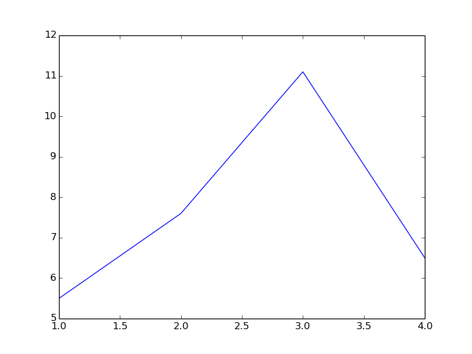
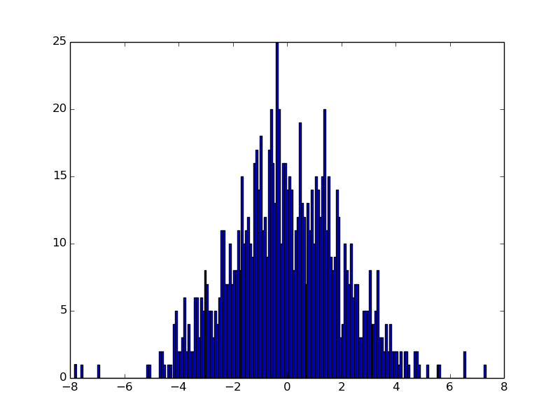
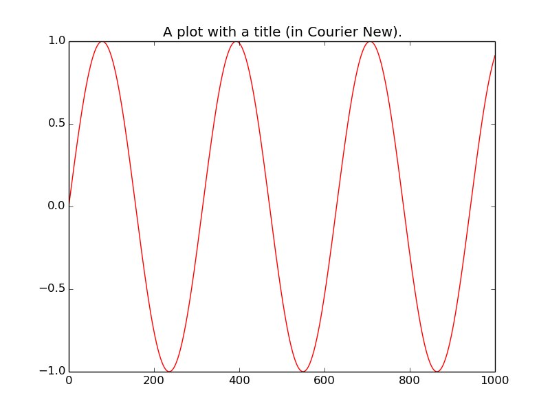
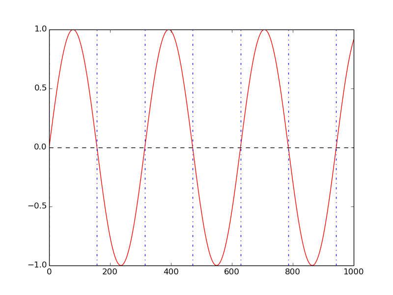
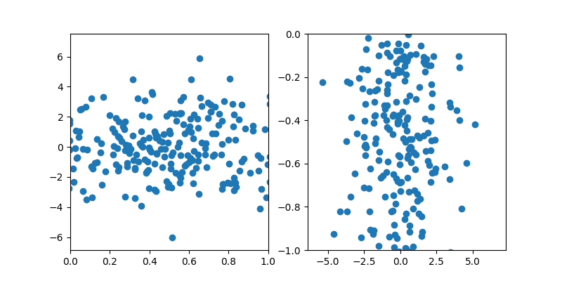

# examples

## plot types

### line, scatter with defaults

```nim
let figure = newFigure()
figure.add newLinePlot[int,float](@[1, 2, 3, 4], @[5.5, 7.6, 11.1, 6.5])
```



### line, scatter with options

```nim
let figure2 = newFigure()
let lp = newLinePlot[int,float](x, y)
lp.linestyle = "--"
lp.colour = "red"
figure2.add lp
let sp = newScatterPlot[int,float](x, y)
sp.colour = "green"
figure2.add sp
```


Custom markers:

```nim
sp.marker = "*"
figure2.save("docs/marker.png")
```


### histograms

With default values:

```nim
let samples = rnorm(1000, 0.0, 2.0)
let figure3 = newFigure()
let hist = newHistogram[float] samples
figure3.add hist
```


With custom number of bins:

```nim
hist.bins = 200
figure3.save "docs/hist_bins.png"
```



You can also create KDE density plots.
For instance:

```nim
let x = rnorm(1000, 0.0, 2.0)
let figure = newFigure()
let dp = newDensity(x)
figure.add dp
figure.save("docs/density.png")
```


### line segments

With default values:

```nim
let figure4 = newFigure()
let x4 = toSeq(0..100)
let y4 = x4.map(proc(k:int):float = float(k).pow(2.0))
figure4.add newLinePlot(x4, y4)
figure4.add newLine((2, 4.0),(70, 70.0.pow(2.0)))
```


Customised:

```nim
lp4.colour = "black"
line.colour = "red"
line.linestyle = "--"
```


### titles and fonts

A plot with a title and custom font ("courier new" in this case):

```nim
let figure5 = newFigure()
let x5 = toSeq(0..1000)
let y5 = x5.map(func(k:int):float = sin(float(k) / 50.0))
figure5.font = ("monospace", "Courier New")
let lp5 = newLinePlot(x5, y5)
lp5.colour = "red"
figure5.add lp5
figure5.add newTitle("A plot with a title (in Courier New).")
```



### vertical and horizontal lines

```nim
let figure6 = newFigure()
let x6 = toSeq(0..1000)
let y6 = x5.map(func(k:int):float = sin(float(k) / 50.0))
let lp6 = newLinePlot(x5, y5)
lp6.colour = "red"
figure6.add lp6
let hl6 = newHorizontalLine(0)
hl6.linestyle = "--"
hl6.colour = "black"
figure6.add hl6
for i in 0..6:
    let vl6 = newVerticalLine(PI * float(i) * 50.0)
    vl6.linestyle = "-."
    vl6.colour = "blue"
    figure6.add vl6
```



### annotations

```nim
let figure7 = newFigure()
figure7.latex = true
let x7 = @[1, 2, 3, 4]
let y7 = @[5.5, 7.6, 11.1, 6.5]
let lp7 = newScatterPlot(x7, y7)
figure7.add lp7
for i in 0..2:
    let ann7 = newAnnotation(float(x7[i]) + 0.1, y7[i] + 0.1, &"$p_{i}$")
    figure7.add ann7
```


## output options

### custom plot size

```nim
figure6.size = (20.0, 2.0)
figure6.dpi = 180
```


### side-by-side plots

```nim
let figure8 = newFigure()
figure8.grid = (rows: 1, cols: 2)
figure8.size = (8.0, 4.0)
figure8.add newLinePlot[int,float](x, y)
figure8.subplot
figure8.add lp6
figure8.add hl6
for i in 0..6:
    let vl6 = newVerticalLine(PI * float(i) * 50.0)
    vl6.linestyle = "-."
    vl6.colour = "blue"
    figure8.add vl6
```


### simple grid

```nim
let figure9 = newFigure()
figure9.size = (8.0, 4.0)
figure9.grid = (3, 3)
let x9 = toSeq(0..<300)
for n in 0..<9:
    if n > 0:
        figure9.subplot
    let fn = proc(d:int):float= sin(float(n)*float(d))
    let lp = newLinePlot(x9, x9.map(fn))
    lp.colour = "red"
    figure9.add lp
```


### horizontal and vertical limits

```nim
let x10 = rnorm(1000, 0.0, 2.0)
let y10 = rnorm(1000, 0.0, 2.0)
let figure10 = newFigure()
figure10.size = (8.0, 4.0)
figure10.grid = (1, 2)
let sp10 = newScatterPlot(x10, y10)
figure10.add newXLimit(0.0, 1.0)
figure10.add sp10
figure10.subplot
figure10.add newYLimit(-1.0, 0.0)
figure10.add sp10
figure10.save("docs/limits.png")
```


